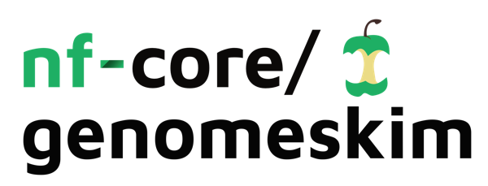

<h1>
  <picture>
    <source media="(prefers-color-scheme: dark)" srcset="docs/images/nf-core-genomeskim_logo_dark.png">
    
  </picture>
</h1>

[](https://github.com/nf-core/genomeskim/actions/workflows/ci.yml)
[](https://github.com/nf-core/genomeskim/actions/workflows/linting.yml)[](https://nf-co.re/genomeskim/results)[](https://doi.org/10.5281/zenodo.XXXXXXX)
[](https://www.nf-test.com)

[](https://www.nextflow.io/)
[](https://docs.conda.io/en/latest/)
[](https://www.docker.com/)
[](https://sylabs.io/docs/)
[](https://cloud.seqera.io/launch?pipeline=https://github.com/nf-core/genomeskim)

[](https://nfcore.slack.com/channels/genomeskim)[](https://twitter.com/nf_core)[](https://mstdn.science/@nf_core)[](https://www.youtube.com/c/nf-core)

## Introduction

**nf-core/genomeskim** is a bioinformatics pipeline that is designed for batch processing of low-coverage genomic DNA sequencing. It is currently designed for and tested on Illumina sequencing data, and takes as input raw sequence reads from shotgun sequencing of a single individual in order to 1. assemble, validate and annotate putative organelle genomes and 2. calculate summary genome statistics based on the non-organellar reads recovered.

<p align="center">
    
</p>

<!-- TODO nf-core: Fill in short bullet-pointed list of the default steps in the pipeline -->

By default, the pipeline currently performs the following:

1. Read QC ([`FastQC`](https://www.bioinformatics.babraham.ac.uk/projects/fastqc/))
2. Adapter trimming ([`FastP`]())
3. Organelle assembly ([`GetOrganelle`]())
4. Taxonomic and coverage validation of contigs ([`BLAST`](), [`Minimap2`](), [`Blobtoolkit`]())
5. Annotation of mitogenomes only ([`MITOS2`]())
6. Nuclear genome summary statistics ([`Jellyfish`](), [`Genomescope2`]())
7. Pipeline QC summaries ([`MultiQC`](http://multiqc.info/))


## Usage

> [!NOTE]
> If you are new to Nextflow and nf-core, please refer to [this page](https://nf-co.re/docs/usage/installation) on how to set-up Nextflow. Make sure to [test your setup](https://nf-co.re/docs/usage/introduction#how-to-run-a-pipeline) with `-profile test` before running the workflow on actual data.

First, prepare a samplesheet with your input data that looks as follows:

`samplesheet.csv`:

```csv
sample,fastq_1,fastq_2
CONTROL_REP1,AEG588A1_S1_L002_R1_001.fastq.gz,AEG588A1_S1_L002_R2_001.fastq.gz
```

Each row represents a fastq file (single-end) or a pair of fastq files (paired end).

Second, you need to know what sort of organellar genome you're trying to assemble, its genetic code and select a database to use for annotation.

Now, you can run the pipeline using:

```bash
nextflow run nf-core/genomeskim \
   -profile <docker/singularity/.../institute> \
   --input samplesheet.csv \
   --outdir <OUTDIR> \
   --getorganelle_genometype <GENOMETYPE> \
   --mitos_geneticcode <CODE> \
   --mitos_refdbid <DB> \
   --skip_validation

```

This minimal example skips validation as this requires further input files. If you want to undertake taxonomic validation, you need a BLAST database to compare against and a local copy of [NCBI taxdump](https://ftp.ncbi.nlm.nih.gov/pub/taxonomy/).

> [!WARNING]
> Please provide pipeline parameters via the CLI or Nextflow `-params-file` option. Custom config files including those provided by the `-c` Nextflow option can be used to provide any configuration _**except for parameters**_;
> see [docs](https://nf-co.re/usage/configuration#custom-configuration-files).

For more details and further functionality, please refer to the [usage documentation](https://nf-co.re/genomeskim/usage) and the [parameter documentation](https://nf-co.re/genomeskim/parameters).

## Pipeline output

To see the results of an example test run with a full size dataset refer to the [results](https://nf-co.re/genomeskim/results) tab on the nf-core website pipeline page.
For more details about the output files and reports, please refer to the
[output documentation](https://nf-co.re/genomeskim/output).

## Credits

nf-core/genomeskim was originally written by [Thomas J. Creedy](https://github.com/tjcreedy), based in part on a pipeline developed by [Oliver White](https://github.com/o-william-white), for use at the [Natural History Museum](https://www.nhm.ac.uk).

We thank the following people for their assistance in the development of this pipeline:

[Silvia Salatino](https://github.com/silvia-s), [Matt Clark](https://www.nhm.ac.uk/our-science/departments-and-staff/staff-directory/matt-clark.html)


## Contributions and Support

If you would like to contribute to this pipeline, please see the [contributing guidelines](.github/CONTRIBUTING.md).

For further information or help, don't hesitate to get in touch on the [Slack `#genomeskim` channel](https://nfcore.slack.com/channels/genomeskim) (you can join with [this invite](https://nf-co.re/join/slack)).

## Citations

<!-- TODO nf-core: Add citation for pipeline after first release. Uncomment lines below and update Zenodo doi and badge at the top of this file. -->
<!-- If you use nf-core/genomeskim for your analysis, please cite it using the following doi: [10.5281/zenodo.XXXXXX](https://doi.org/10.5281/zenodo.XXXXXX) -->

<!-- TODO nf-core: Add bibliography of tools and data used in your pipeline -->

An extensive list of references for the tools used by the pipeline can be found in the [`CITATIONS.md`](CITATIONS.md) file.

You can cite the `nf-core` publication as follows:

> **The nf-core framework for community-curated bioinformatics pipelines.**
>
> Philip Ewels, Alexander Peltzer, Sven Fillinger, Harshil Patel, Johannes Alneberg, Andreas Wilm, Maxime Ulysse Garcia, Paolo Di Tommaso & Sven Nahnsen.
>
> _Nat Biotechnol._ 2020 Feb 13. doi: [10.1038/s41587-020-0439-x](https://dx.doi.org/10.1038/s41587-020-0439-x).
